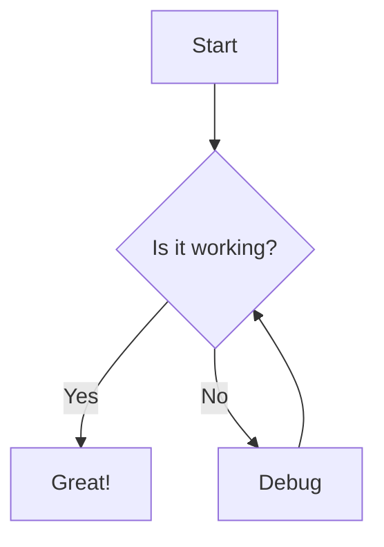

# Demo Page

This page showcases various components and features available in our custom template system.

## Text Components

### Headings
# Heading 1
## Heading 2
### Heading 3
#### Heading 4
##### Heading 5
###### Heading 6

### Text Formatting
**Bold text** and *italic text* and `inline code`.

### Lists
- Unordered list item 1
- Unordered list item 2
  - Nested item
  - Another nested item
- Unordered list item 3

1. Ordered list item 1
2. Ordered list item 2
3. Ordered list item 3

### Blockquotes
> This is a blockquote. It can span multiple lines and contain **bold** or *italic* text.

### Code Blocks
```javascript
function hello() {
  console.log("Hello, world!");
}
```

## Visual Components

### Sample Cards
<div class="grid grid-cols-1 md:grid-cols-2 lg:grid-cols-3 gap-6 my-8">
  <div class="bg-white rounded-lg shadow-lg p-6 border border-gray-200">
    <div class="text-3xl mb-4">💻</div>
    <h3 class="text-xl font-bold mb-2">Web Development</h3>
    <p class="text-gray-600">Modern, accessible sites that convert—Hugo, Next.js, or your stack.</p>
  </div>
  
  <div class="bg-white rounded-lg shadow-lg p-6 border border-gray-200">
    <div class="text-3xl mb-4">🎨</div>
    <h3 class="text-xl font-bold mb-2">Product Design</h3>
    <p class="text-gray-600">User-centered UX/UI, wireframes, and rapid prototypes.</p>
  </div>
  
  <div class="bg-white rounded-lg shadow-lg p-6 border border-gray-200">
    <div class="text-3xl mb-4">📱</div>
    <h3 class="text-xl font-bold mb-2">Custom Apps</h3>
    <p class="text-gray-600">Ionic/Angular mobile apps, secure cloud backends, and integrations.</p>
  </div>
</div>

### Sample Alerts
<div class="bg-blue-50 border-l-4 border-blue-400 p-4 mb-4">
  <div class="flex">
    <div class="flex-shrink-0">
      <svg class="h-5 w-5 text-blue-400" viewBox="0 0 20 20" fill="currentColor">
        <path fill-rule="evenodd" d="M18 10a8 8 0 11-16 0 8 8 0 0116 0zm-7-4a1 1 0 11-2 0 1 1 0 012 0zM9 9a1 1 0 000 2v3a1 1 0 001 1h1a1 1 0 100-2v-3a1 1 0 00-1-1H9z" clip-rule="evenodd" />
      </svg>
    </div>
    <div class="ml-3">
      <p class="text-sm text-blue-700">
        This is an info alert with some important information.
      </p>
    </div>
  </div>
</div>

<div class="bg-yellow-50 border-l-4 border-yellow-400 p-4 mb-4">
  <div class="flex">
    <div class="flex-shrink-0">
      <svg class="h-5 w-5 text-yellow-400" viewBox="0 0 20 20" fill="currentColor">
        <path fill-rule="evenodd" d="M8.257 3.099c.765-1.36 2.722-1.36 3.486 0l5.58 9.92c.75 1.334-.213 2.98-1.742 2.98H4.42c-1.53 0-2.493-1.646-1.743-2.98l5.58-9.92zM11 13a1 1 0 11-2 0 1 1 0 012 0zm-1-8a1 1 0 00-1 1v3a1 1 0 002 0V6a1 1 0 00-1-1z" clip-rule="evenodd" />
      </svg>
    </div>
    <div class="ml-3">
      <p class="text-sm text-yellow-700">
        This is a warning alert with a caution message.
      </p>
    </div>
  </div>
</div>

### Sample Buttons
<div class="flex flex-wrap gap-4 my-8">
  <button class="bg-blue-600 hover:bg-blue-700 text-white font-bold py-2 px-4 rounded">
    Primary Button
  </button>
  <button class="bg-gray-600 hover:bg-gray-700 text-white font-bold py-2 px-4 rounded">
    Secondary Button
  </button>
  <button class="bg-green-600 hover:bg-green-700 text-white font-bold py-2 px-4 rounded">
    Success Button
  </button>
  <button class="border border-blue-600 text-blue-600 hover:bg-blue-50 font-bold py-2 px-4 rounded">
    Outline Button
  </button>
</div>

### Sample Progress Bars
<div class="space-y-4 my-8">
  <div>
    <div class="flex justify-between mb-1">
      <span class="text-sm font-medium text-gray-700">Basic Progress</span>
      <span class="text-sm font-medium text-gray-700">75%</span>
    </div>
    <div class="w-full bg-gray-200 rounded-full h-2">
      <div class="bg-blue-600 h-2 rounded-full" style="width: 75%"></div>
    </div>
  </div>
  
  <div>
    <div class="flex justify-between mb-1">
      <span class="text-sm font-medium text-gray-700">Success Progress</span>
      <span class="text-sm font-medium text-gray-700">90%</span>
    </div>
    <div class="w-full bg-gray-200 rounded-full h-2">
      <div class="bg-green-600 h-2 rounded-full" style="width: 90%"></div>
    </div>
  </div>
</div>

## Media Components

### Images


## Advanced Features

### Math (if enabled)
Inline math: $E = mc^2$

Block math:
$$
\int_{-\infty}^{\infty} e^{-x^2} dx = \sqrt{\pi}
$$

### Diagrams (if enabled)


## Conclusion

This demo page shows many of the components available in our custom template system. You can use these components throughout your site to create rich, interactive content.

## What's Different?

Since we're using a custom template system instead of Blowfish's built-in components, we've simplified the demo to show what works with our current setup:

- ✅ **All text formatting** - Bold, italic, code, lists, etc.
- ✅ **Links and navigation** - Internal and external links
- ✅ **Images** - Basic image display
- ✅ **Code blocks** - Syntax highlighting
- ✅ **Visual components** - Cards, alerts, buttons, progress bars
- ✅ **Math and diagrams** - If your Hugo setup supports them

The custom template gives us full control over the styling and ensures everything works consistently across all pages.
